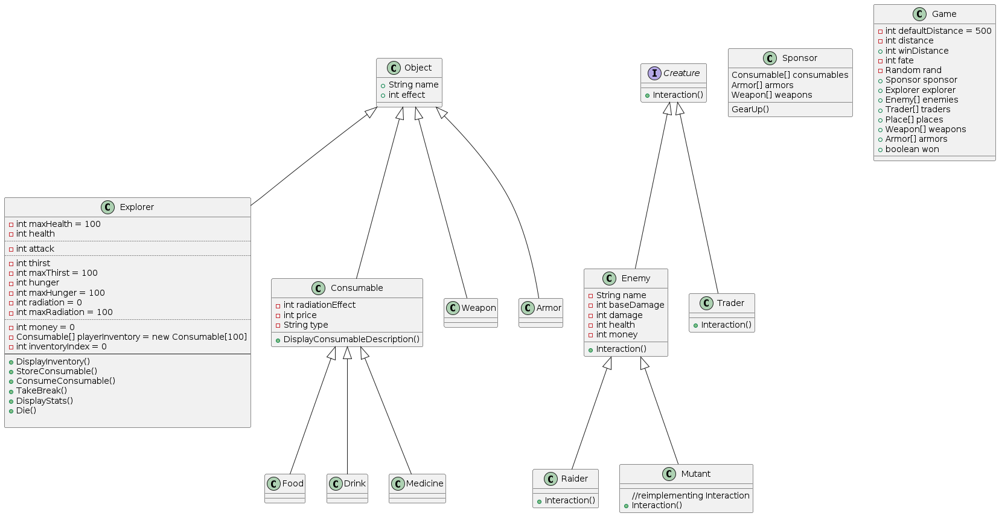
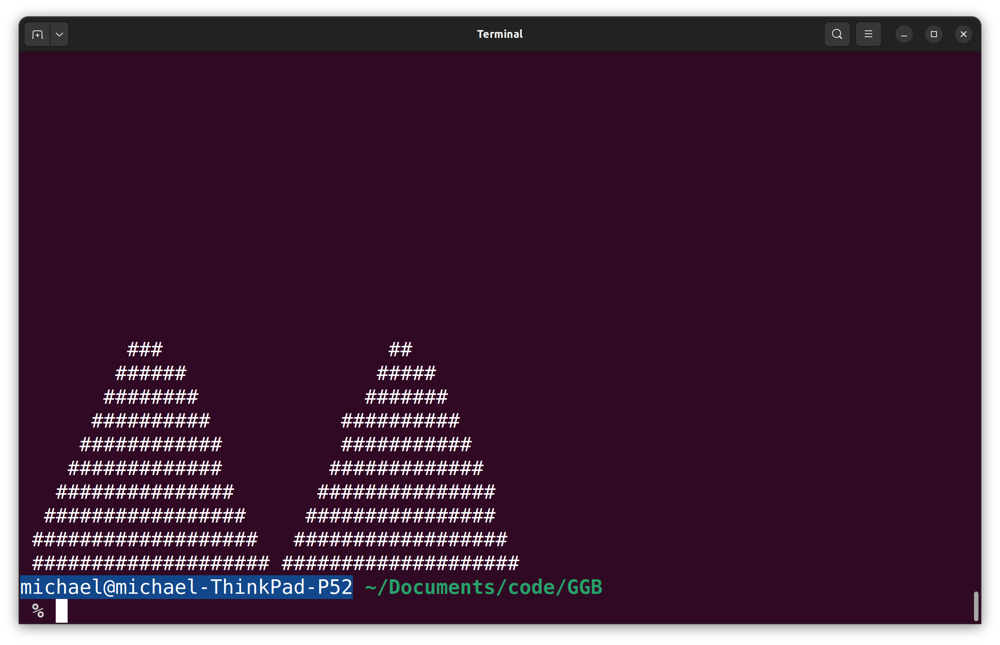

# OOP-SIM

I have decomposed some functions into View and Control. I moved the gameplay loop to Control and all the declarations to the Model. To be honest my output and input are tied to the logic in the classes themselves so breaking them to the MVC model will just be more code for the sake of pointless structure.

 
==============================================================
 

I have completed the bonus task given to me by Alexandr Vdovicenko, Golden Gate Bridge :
